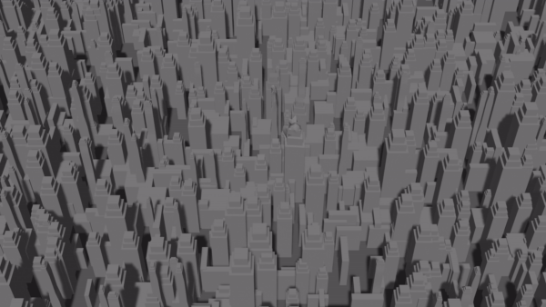
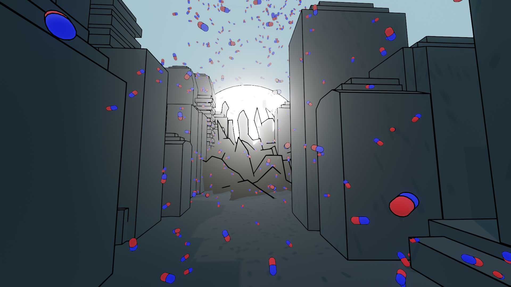
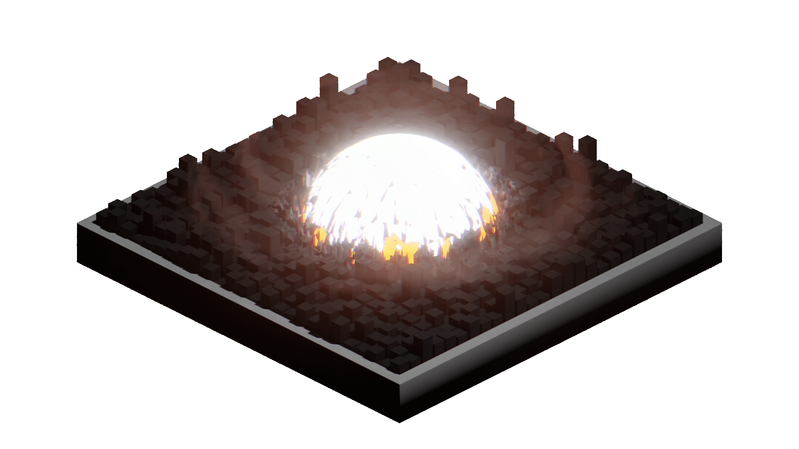
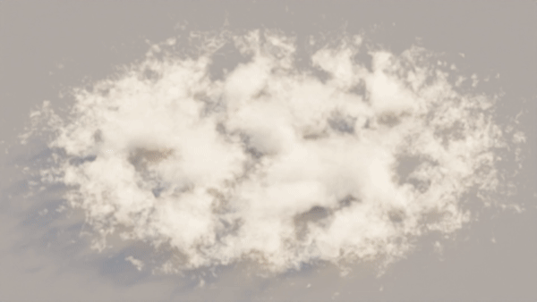
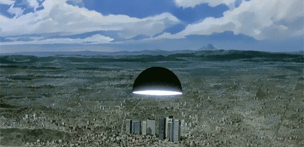
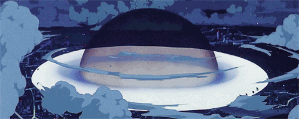
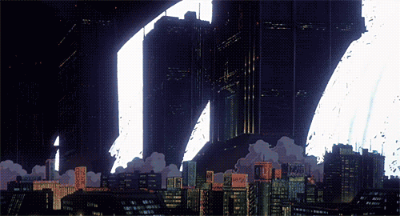
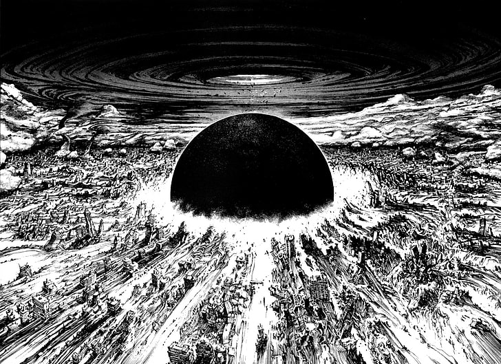
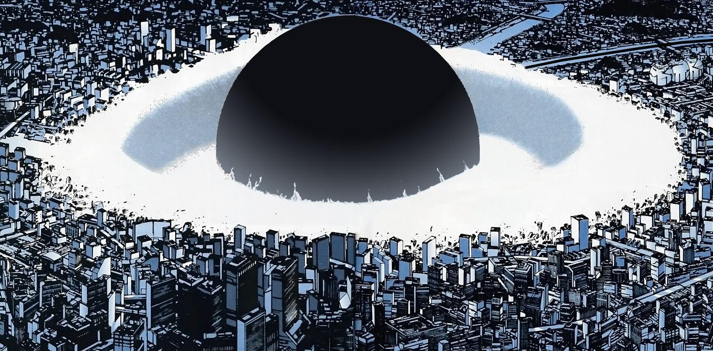
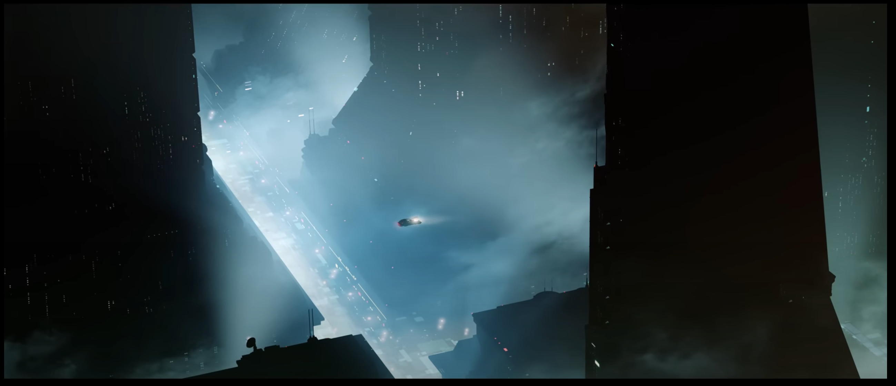

# Akira Bomb - Breakdown

 
    

|[High-Quality Gif](https://github.com/arfx/webpage/AkiraBomb/blob/main/Notes/Source/Final/Akira-Bomb-UE5.gif)|[Video with Audio](https://twitter.com/antonsfx/status/1684897440166502400)|
|---|---|

<!---  --->

---

# Table of Content

- [Introduction](#introduction)
- [Background-Story](#background-story)
- [Pre-production](#pre-production)
  * [🎞 References - Overall Scene](#-references---overall-scene)
- [Production](#production)
  * 🌍 [World Position Offset - Building Deformation](https://github.com/arfx/webpage/AkiraBomb/blob/main/Notes/WorldPositionOffset-BuildingDeformation.md)
  * 🏬 [Procedural City Generation](https://github.com/arfx/webpage/AkiraBomb/blob/main/Notes/Procedural%20City%20Generation.md)
  * ☁️ [Niagara Fluids - Clouds Motion](https://github.com/arfx/webpage/AkiraBomb/blob/main/Notes/Niagara%20Fluids%20-%20Clouds%20Motion.md)
- [Challenges - Struggle](#challenges---struggle)
  * 🎵 [SFX](https://github.com/arfx/webpage/AkiraBomb/blob/main/Notes/SFX.md)
  * 💥 [Impact Frames](https://github.com/arfx/webpage/AkiraBomb/blob/main/Notes/Impact%20Frames.md)
  * ⛅ [Scene Lighting](https://github.com/arfx/webpage/AkiraBomb/blob/main/Notes/Scene%20Lighting.md)
- [Post Production](#post-production)

---

# Introduction

I have recreated a version of the famous Akira Sphere Bomb Sequence from the film "Akira" using Unreal Engine 5. This version showcases the breathtaking depiction of destructive power, as a massive energy wave engulfs the city of Neo-Tokyo in a stunning combination of light and destruction.

# Background-Story

To say that this theme has haunted me for years would be an understatement.

I believe anyone who has seen the film "Akira" was deeply impacted by this particular scene. This feeling intensified when I finally decided to read the manga years after watching the movie. (In short, I highly recommended it, as it offers a much more extensive experience than the film.)

Since then, this special shot has never left my mind. I often find myself using that Sequence for small test projects or to explore new techniques and styles. It has become my go-to reference.

    
    
    
    

This time, I set out with a clear goal in mind

> [!GOAL] 🥅 To complete that **Akira Bomb Shot** + learn new technics and share my process.

# Pre-production

As mentioned before, this is not my first time working on this shot, so I had a clear vision in my mind and plenty of references stored.

I always envisioned an isometric camera angle, with the buildings starting, the sphere central, and occupying the frame over time. Portraying the immense size and power behind this explosion was crucial to me. Hence, I quickly decided to add a second camera angle to increase and see the buildings in closer view when they dissolving.

I knew early on that I wanted to use procedural skyscrapers for this shot, focusing on large shapes rather than intricate designs due to their sheer quantity.

Furthermore, I had always imagined a genuine distortion and resolution of the buildings, which I planned to achieve using the World Position Offset. I also aimed to delve deeper into realistic cloud and smoke behavior, as I had experimented with them in previous versions using Houdini. However, now having the opportunity to work in real-time, I wanted to test the Niagara Fluids System, which I hadn't explored before.

## 🎞 References - Overall Scene

    
Akira Movie

    
    
    

Akira Manga

    
    

others

     
    
    

*[Blade Runner 2033 Labyrinth Game Trailer - Building Windows Size](https://youtu.be/l_tfihRqBnI?t=17)*  - 
*[FickleSwimming - experiments in the Year 2020](https://twitter.com/FickleSwimming/status/1344636130172563456)*  - 
*[Miguel Rodriguez - Akira-Style Explosion](https://80.lv/articles/a-beautiful-akira-style-explosion-made-in-blender/)* 

# Production

My approach was very basic but as I start with all projects, tackle the unknown task first. Which meant getting that Deformation working.

## 🌍 [World Position Offset - Building Deformation](https://github.com/arfx/webpage/AkiraBomb/blob/main/Notes/WorldPositionOffset-BuildingDeformation.md)
## 🏬 [Procedural City Generation](https://github.com/arfx/webpage/AkiraBomb/blob/main/Notes/Procedural%20City%20Generation.md)  
## ☁️ [Niagara Fluids - Clouds Motion](https://github.com/arfx/webpage/AkiraBomb/blob/main/Notes/Niagara%20Fluids%20-%20Clouds%20Motion.md)

# Challenges - Struggle

## 🎵 [SFX](https://github.com/arfx/webpage/AkiraBomb/blob/main/Notes/SFX.md)
## 💥 [Impact Frames](https://github.com/arfx/webpage/AkiraBomb/blob/main/Notes/Impact%20Frames.md)
## ⛅ [Scene Lighting](https://github.com/arfx/webpage/AkiraBomb/blob/main/Notes/Scene%20Lighting.md)

# Post Production

Because it was all done in Unreal there was not much Post Production, I only add in Davinci Resolve a bit more Zoom + Motion Blur around the Impact Point and replace the inverted Post FX frame to the still painted Impact Frames, extended the Start + End Full Frame Color and added the SFX.
