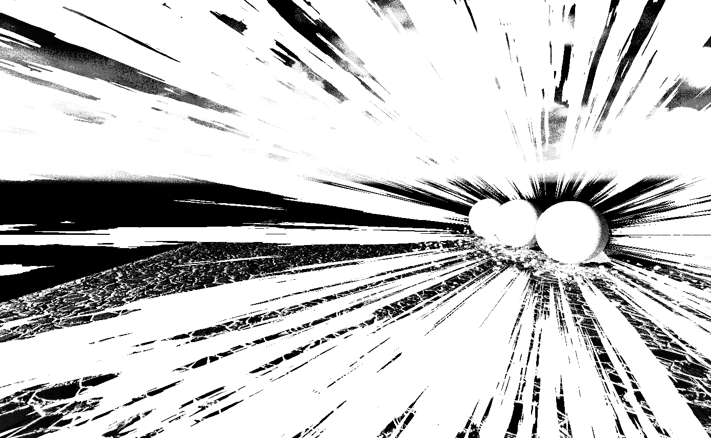
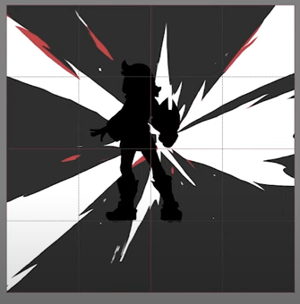
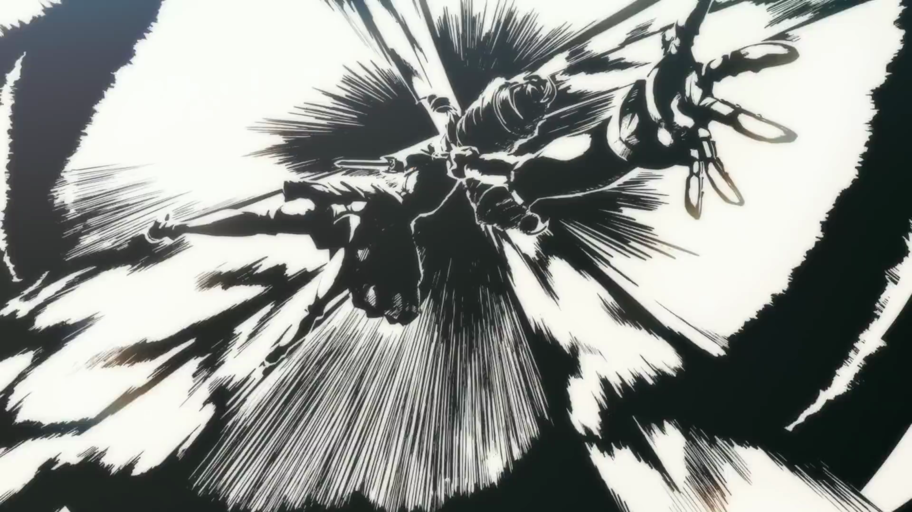
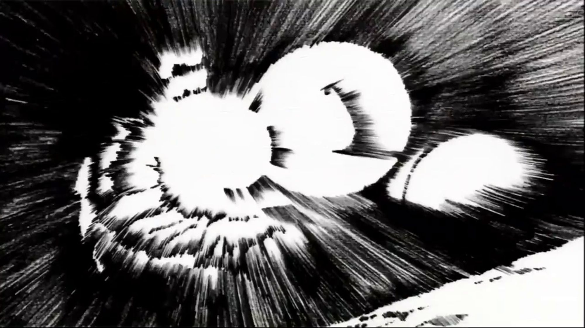
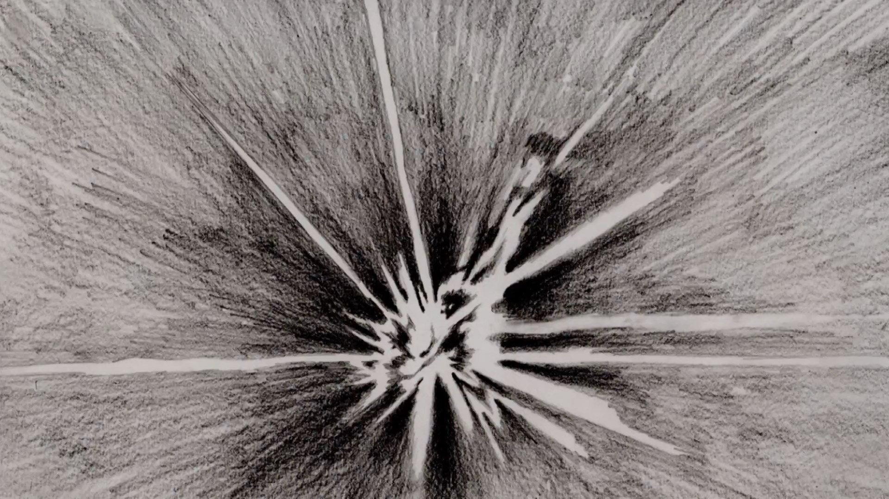
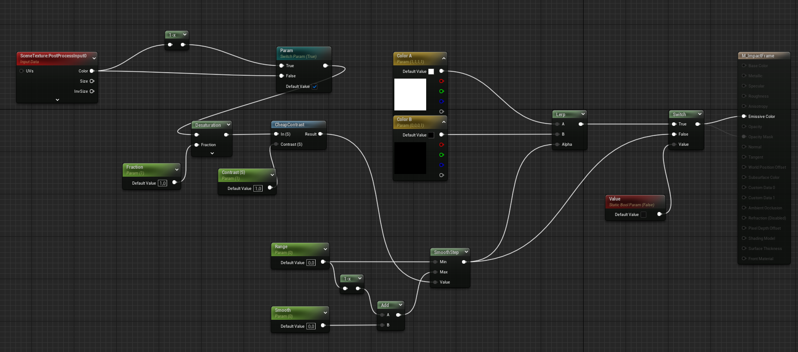
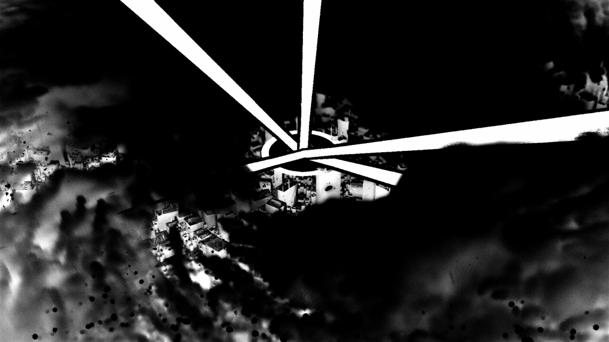
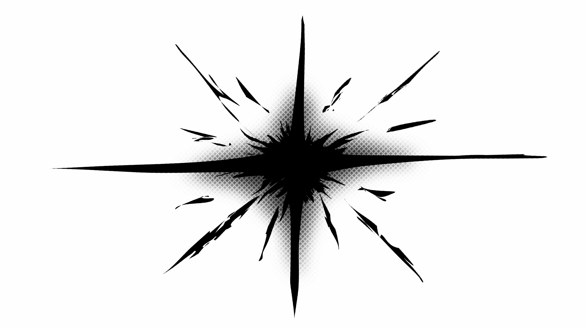
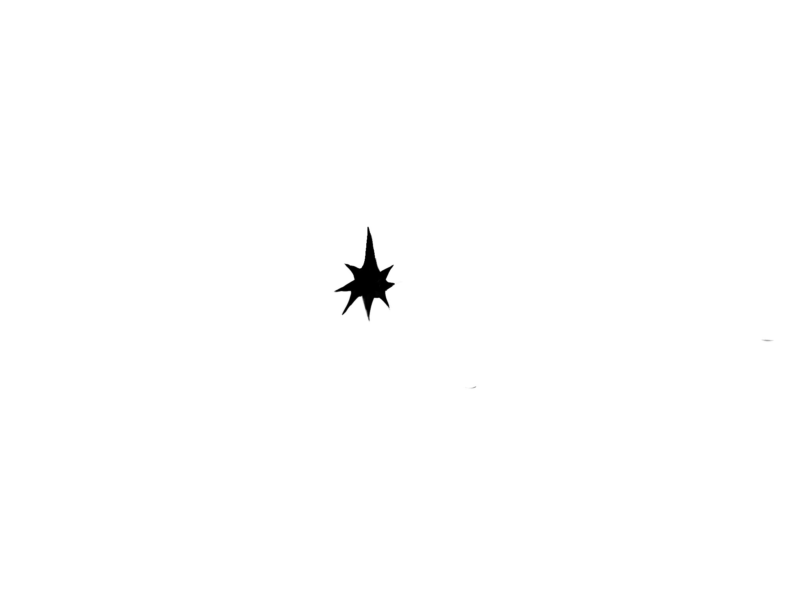

# Impact Frames

Since I love Impact Frames, I was very early ready to invest more time in it as well.

I had also been playing around with post FX shaders for a few weeks before, especially for impact frame moments. Even if I had a good first approach with it, these results were always too static for me. Which is why I switched to hand-drawn impact frames during the course of the progress.

Or better I mix of both , I made my drawing with transparent background and used the invert flip from the post FX shader and the InEngine footage.

### Reference - Impact Frame

2023-05-02 - previous Post Shader I did - with scrolling textures

[Diana Lott - "Impact Frames" Shader Effect|noembed](https://www.artstation.com/artwork/mDAly9)

[VFX Apprentice - Drawing|noembed](https://youtu.be/mcOozpmIxLw?t=199)

[Impact Frames Bot|noembed](https://twitter.com/impactframesbot/status/1286222816254328833/photo/3)

[https://www.sakugabooru.com/post/show/2313|noembed](https://www.sakugabooru.com/post/show/2313)

[kViN|noembed](https://twitter.com/Yuyucow/status/775398621030252545/photo/2)

### Engine Shader - Post Effect

Shader Graph - for the Invert Post FX Shader + additional Parameter for contrast, saturation, etc

Black without EyeAdaption - White with EyeAdaption

In the beginning it was very important for me that I could animated some of these values also over the sequence, which I shared some parameters and added then in the Global Post Process as “Post Process Material”.

### Drawing

The Drawing Process was quite I started with a still inverted Frame from the Engine and drew over it.

drawing process - starting with one rendered frame - first version

final version - with out Sequence blow

quick tablet drawing test

---

[Back to Main Page](https://github.com/arfx/webpage/AkiraBomb/edit/main/AkiraBomb.md)