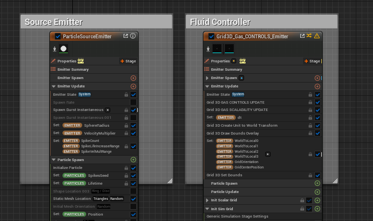
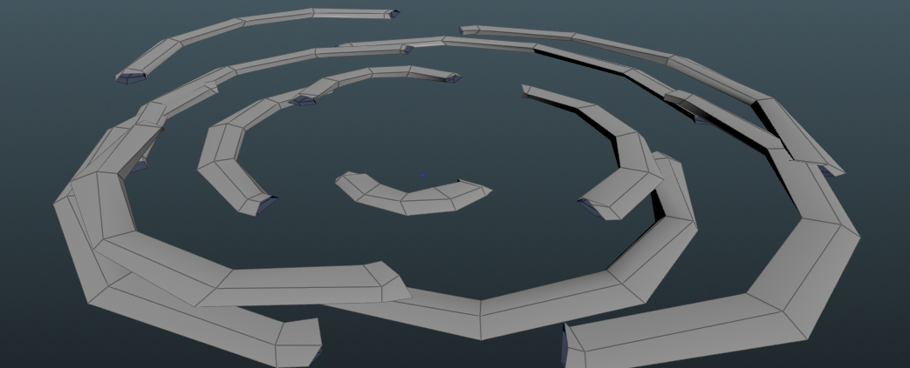
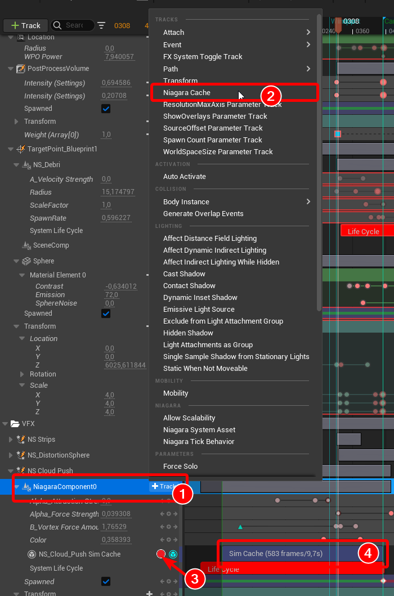
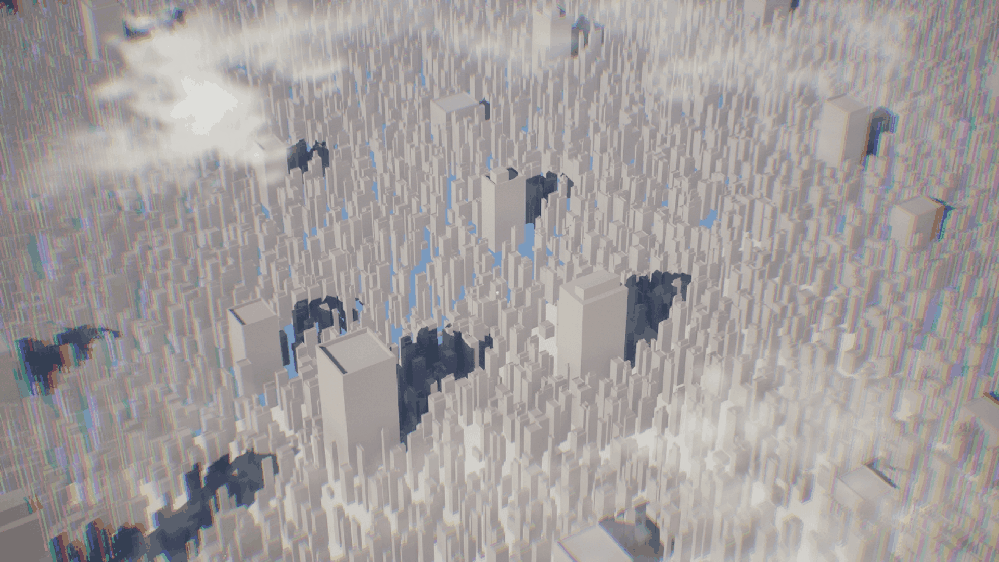
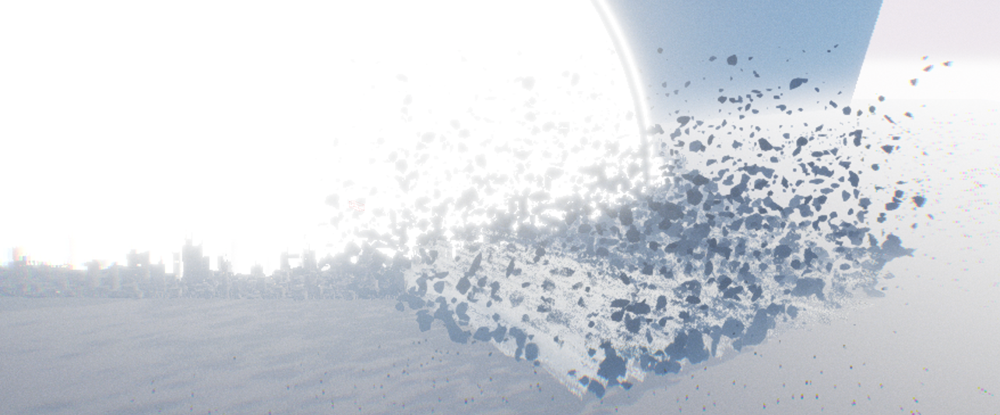

# Niagara Fluids - Clouds Motion

One completely new item I never got around to trying out in the last few years was the Niagara Fluids from the last Unreal Engine versions.

I have always liked to play around with other fluids systems whether in Cinema 4D, Maya, Max, Realflow, Houdini or Blender and so I gave me a limitation only use the Unreal Engine Niagara Fluids to make all smoke / clouds in the complete sequence.

First, I opened some Niagara Fluids templates and changed some values to see how they behaved. Surprisingly, I found that they were divided into two different emitters. One for source emitters and the other for the whole fluid behavior. Thanks to my previous long experience in Unreal Niagara System, it was very easy to create a source emitters to create any kind of motion.

Niagara Fluid - both Emitter

Mainly I used Forces to drive the Source Emitters Particle and animated these over the Sequence Timeline.

More Issues I had in the beginning with that the Startframes where all only points that wasn´t merged like real clouds, which I tried by making longer sims before they are pre-moved via Force. But I got this later in the process solved by spawning the particle from a static mesh (which was only some place planes), before I use the Torus Location with additional Curl Noise Offset.

Final Source Emitter Spawn Mesh

Niagara Cache

Also helped later on the Sequencer the Niagara Fluid Cache function. Where you bake you simulation down and can modify a bit this Cache in stretching, offsetting, etc.

In general I struggelt in

iterations over the Niagara Fluid System

In general, I struggled with the resolution and detail from the clouds in both shots.

Especially since this goes very fast on the GPU depending on I increased the “Resolution Max Axis” of the Niagara System (which are the voxel of the sim). At the beginning I still used the Uniform World Size, but I notice at the latest with the second shot that I should split them into the individual axes.

For the second shot I use a different Niagara Fluid System from the beginning, because I don't have to calculate the full circle around the sphere. But above all, the World Space for the different axes has helped a lot because this shot is very long, but not veryhigh.

Which was perfect to reduce the Z Axis and increase the X Axis.

Sideview of the second Shot

---

[Back to Main Page](https://github.com/arfx/webpage/AkiraBomb/edit/main/AkiraBomb.md)