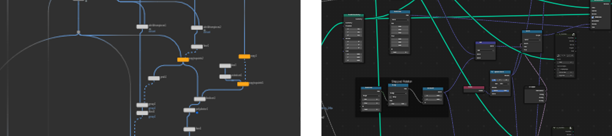
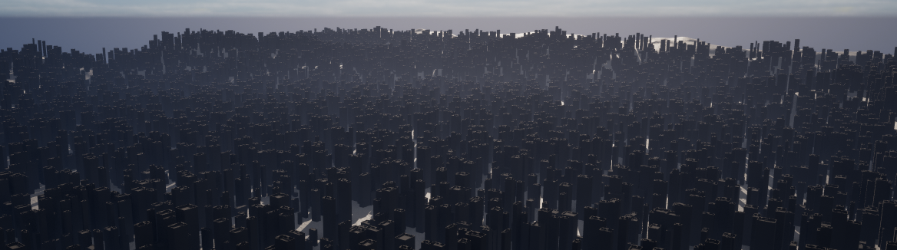
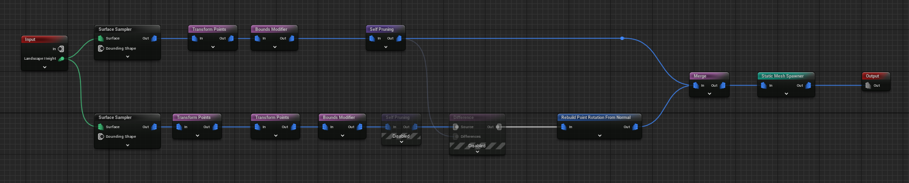
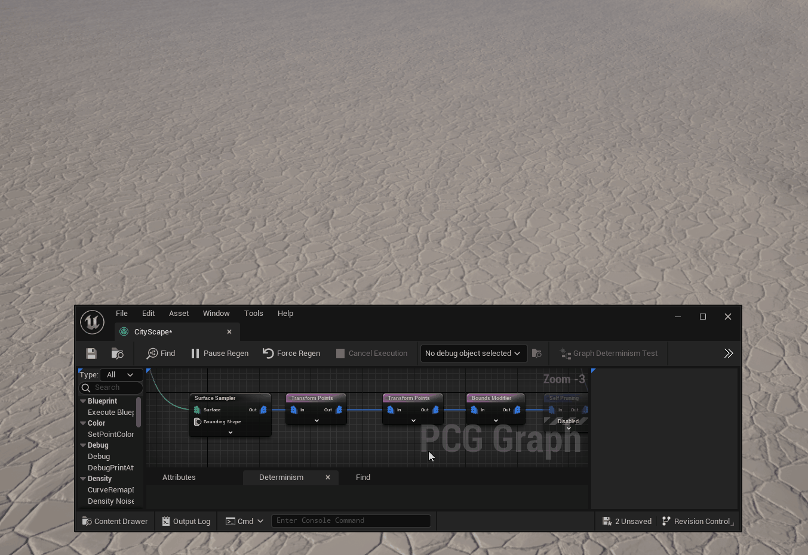
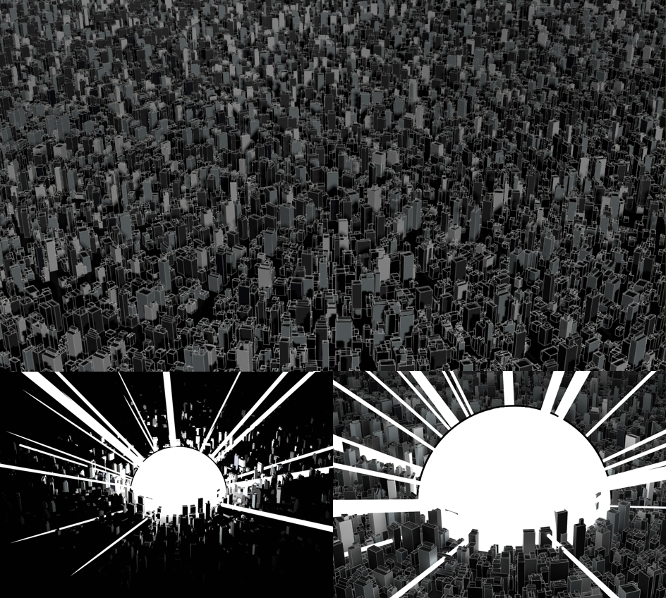
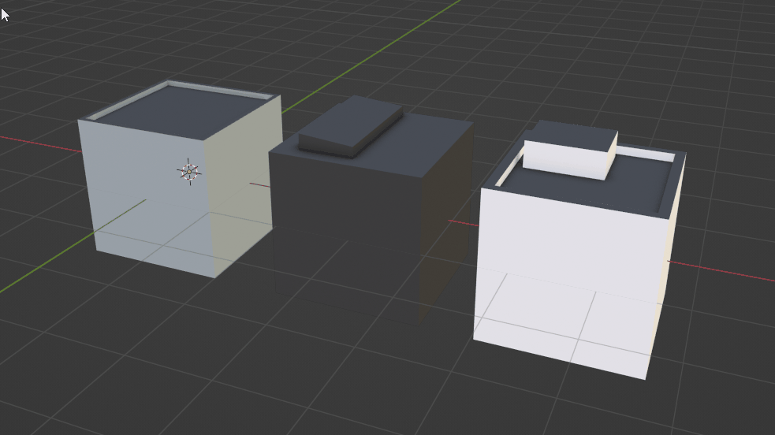
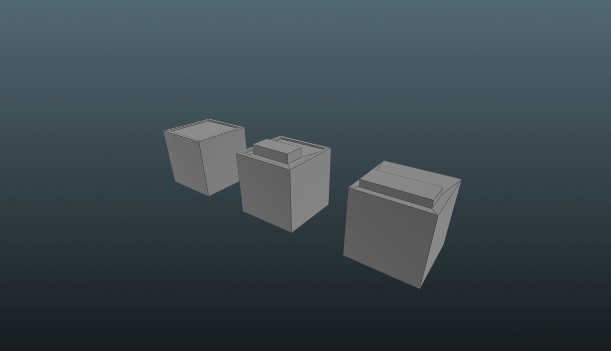

# Procedural City Generation

For the buildings, I quickly know that I wanted/need to have a procedural approach. Since I was interested in procedural buildings before, I was already familiar with some methods.

### multiple Methods

[Procedural Content Generation Overview](https://docs.unrealengine.com/5.2/en-US/procedural-content-generation-overview/)
In Engine Procedural Creation (UE5)

Prebuild Asset in Houdini / Blender (Geo Nodes)

WFC - Wave Function Collapse Algorithm

[Wave Function Collapse - Mixed Initiative Demo](https://bolddunkley.itch.io/wfc-mixed)
Online Demo from Martin Donald

[Labs Wave Function Collapse](https://sidefxlabs.artstation.com/projects/DAB6lO)
Houdini to UE5 a direct method

### In Engine Procedural Creation (UE5)

 For the In Engine Procedural City Generation, I needed to upgrade from Unreal 4.27 to Unreal 5.2 which I did in the End anyway.

[a good starting point for PCG in UE5 - I used it as well](https://youtu.be/aoCGLW53fZg)

In the beginning, it was really stunning how fast I got something. Here I scatter over the whole landscape (by grabbing the landscape Z Height Position) my default building Blocks (3 different higher poly Boxes with some random height)

---

It's in general quite simple, you place a PCGVolume in your scene and create a PCG Graph in which you can similar to Blueprints (but very reduced and different nodes).

An extremely good point on that is how you can Debug each node. By hovering a node a pressing “D”, you get a cyan Dot on your Node which is then shown in the viewport as cubes, redoing that same step, disables the Debug Mode.

Similar to that you can also by pressing “E” when hovering over a node Enable/Disable a node.

In the End, may was very simple.

ℹ️ But a very big Learning for Unreal Procedural Creation → Enable on all Meshes Nanite

- Issues without Nanite
  
    Before it was all the time laggy as hell + also then it was hiding objects by distance which result in weird popping.

---

The result was already very satisfying, especially when moving the sphere around in the whole scene. But I didn´t find some ways, that I could achieve some major points for me:

- more control over the random height
- more control over the space between the buildings
- rotation to a center point

Why I moved on to the next section.

### Prebuild Asset

####  Blender (GeoNodes)

Some weeks before the start of the whole Unreal Akira Bomb Project, I did already a very rudimentary version of this Building Setup in Blender with Geometry Nodes, which grow my interest in a proper animated scene of that.

That was the spark of that whole Unreal Project.

2023-04-01 - Blender Geometry Node - Building Setup

In short, it was only scattering three different kinds of Boxes (which were also randomized in scale) on a circle object + making some center orientation + stepped 90-degree rotation.

[Source File of the Geometry Node Building](Source/quick_building_geonode.blend)
Source File of the Geometry Node Building

---

####  Houdini

Because in Blender everything still overlapped and had no easy way to increase the polycount ([what I need for the deformation of the WPO](AkiraBomb-Breakdown.md#World%20Position%20Offset%20-%20Building%20Deformation)) by the height of the Buildings or add later UV for each of these Buildings. I decided I recreated this in Houdini in a very similar approach.

- Build 3 different 1x1 Box House
- created already a Separation of roof UV and Walls(Height) UV
- scatter some points on a plane
- set point to direction to center
- added steeped 90degree rotation
- added randomized pscale/scale attributes to point
- copied box house to points
- created a second scatter point with the same steps but different randomize
- used first result to check for overlaps with the second scatter result
- removed these and combined but results
- fill in between spaces with smaller building (same method) +combined that again
- new added on the highest buildings some additional deco stuff (which was also boxes)
- adjusted Height UVs by the pscale + height scale
- Done

step through the Houdini Building process

---

[Back to Main Page](https://github.com/arfx/webpage/AkiraBomb/edit/main/AkiraBomb.md)