# Scene Lighting

For the Scene Lighting, I had at the beginning really a direction in my mind. From the original Scene Reference, there is a different version already. The Movie has a more daylight approach and gets darker over the sequence. For the Manga, it´s always quite dark but still, there are some shades visible.

This is why I started to collect some different City Lighting Reference. Still, after that, I wasn´t so sure which road to go.

### Reference - Lightning

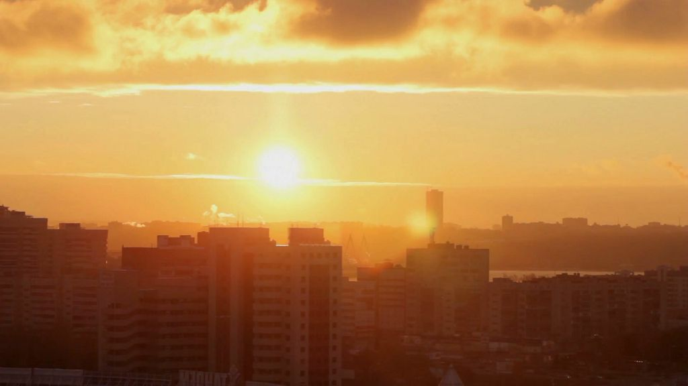
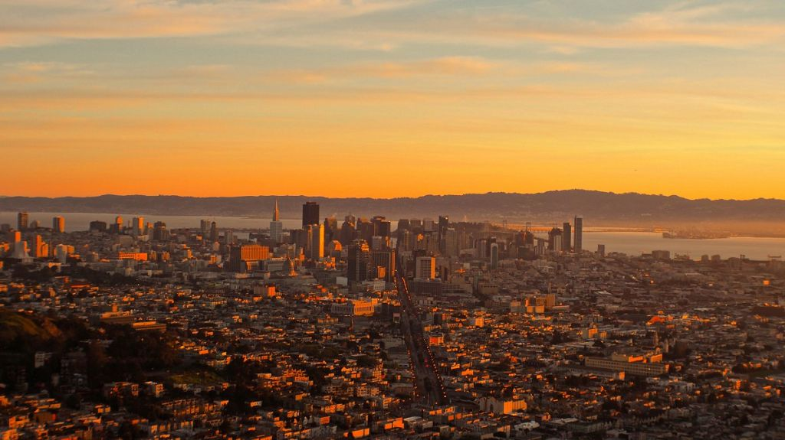
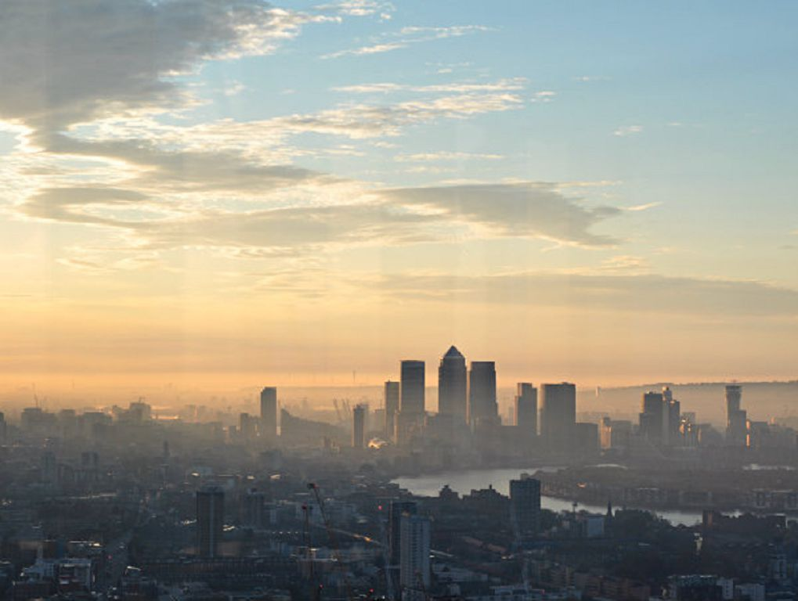
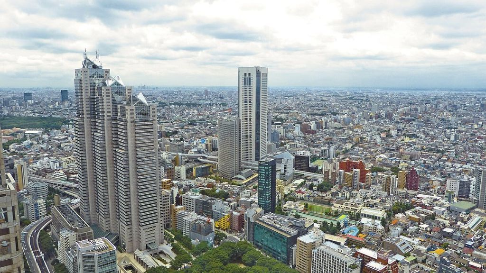
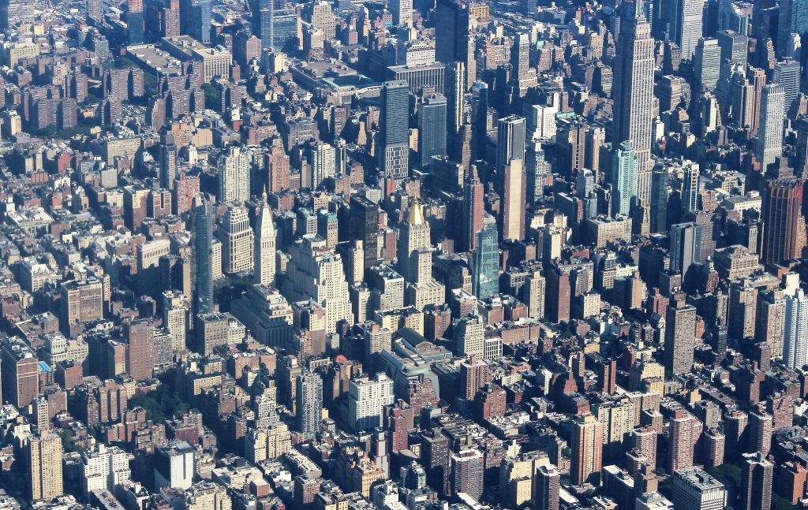

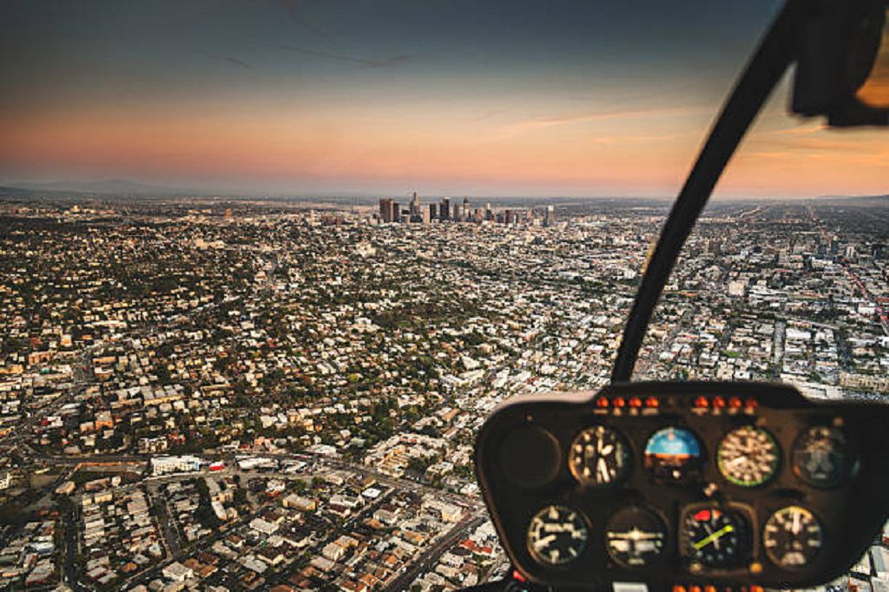
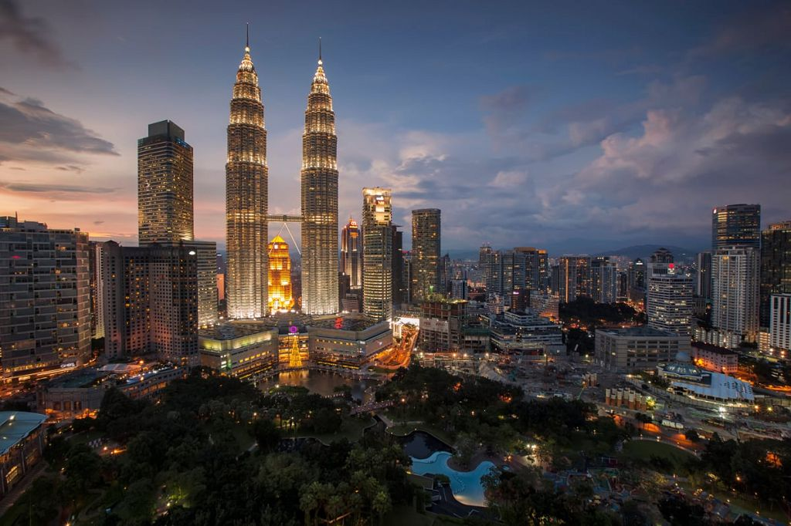
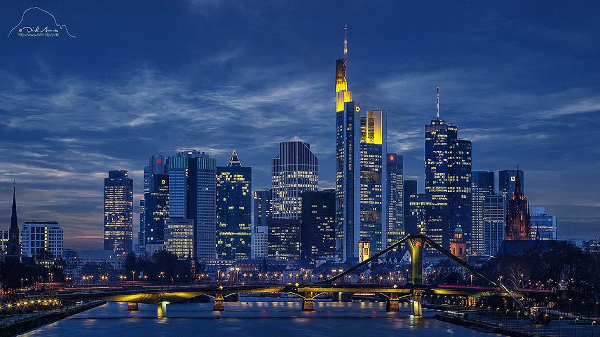
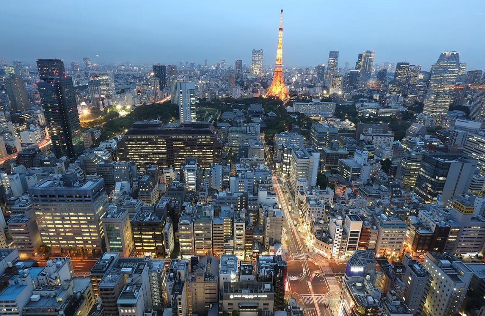
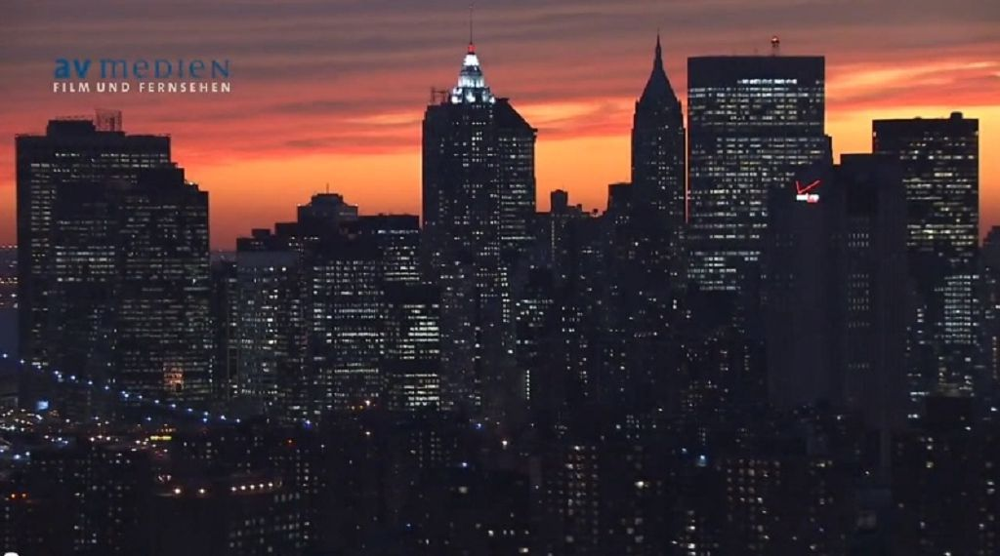
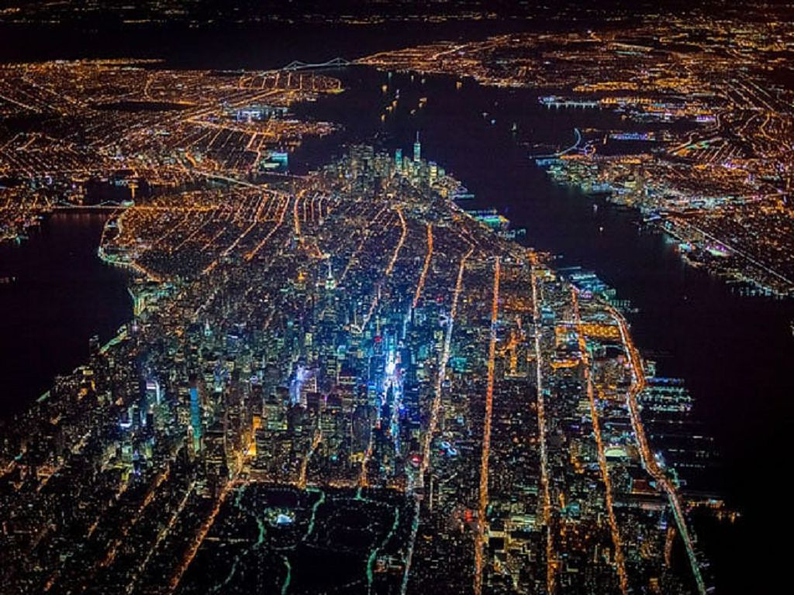
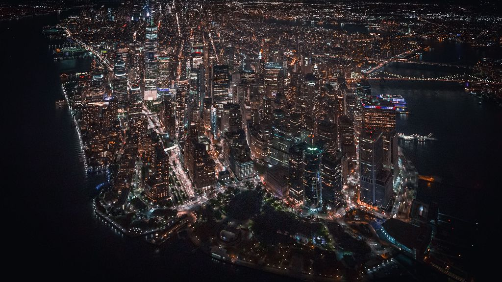
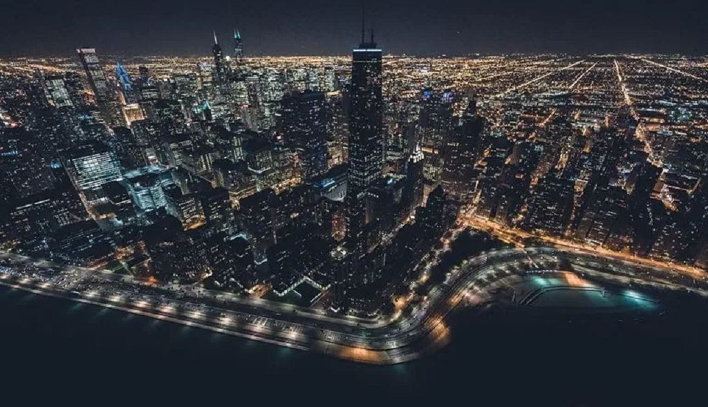
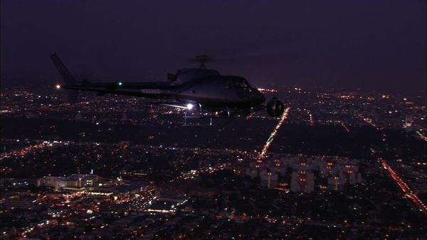

### Lightning

Why I played a bit around in Unreal with the AWESOME Lighting Shortcut. You need to have DirectionalLight placed in your Scene.

<aside> 👌 press **Ctrl + L** and hold while moving the mouse

</aside>

With that, you can find fast and easy your right Light Direction/Mood and continue on that.

In the end, I used some Light from behind but also daytime because the Bloom and Eye Adaption made the rest of the Scene anyway dark next to the Bright White Sphere.

---

[Back to Main Page](https://github.com/arfx/webpage/AkiraBomb/edit/main/AkiraBomb.md)