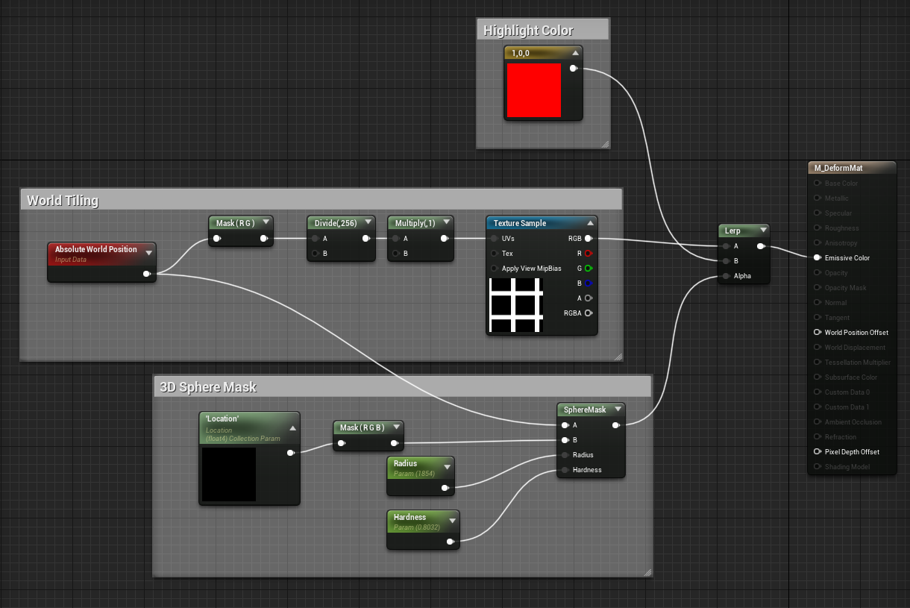
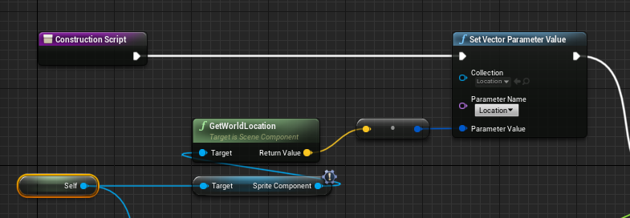
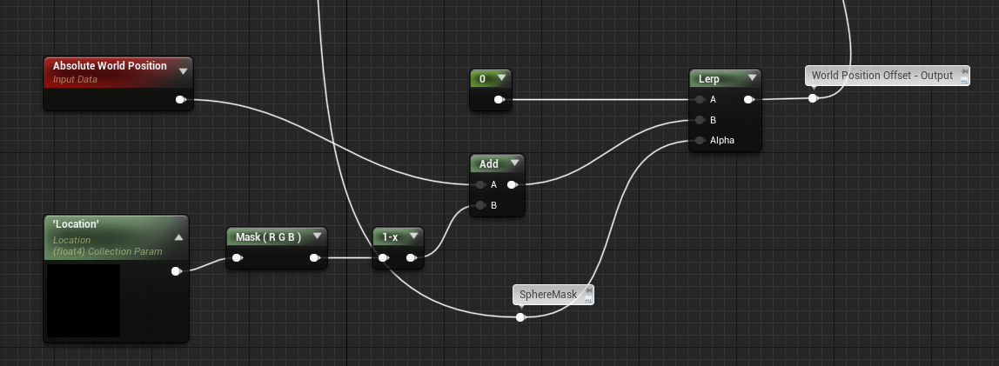
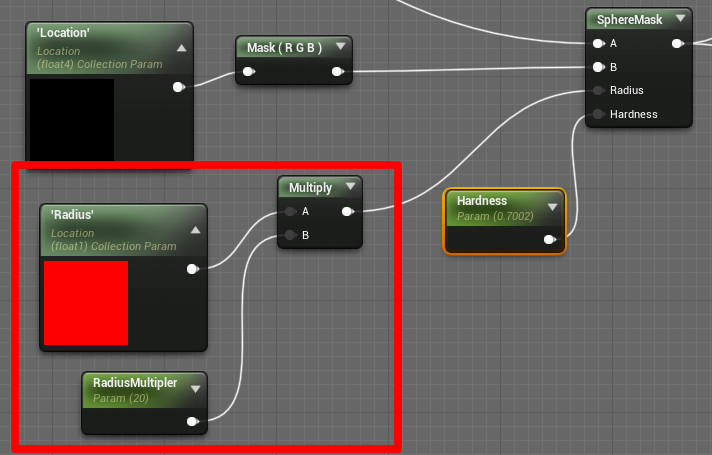
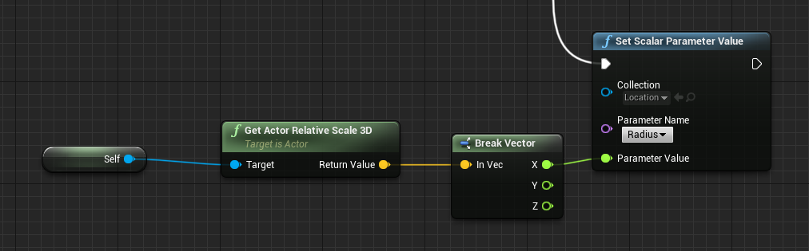

# World Position Offset - Building Deformation

- set position from 3D Sphere Mask for the Building Position via [Collection Parameter](https://www.unrealengine.com/en-US/blog/material-parameter-collections) which was then via Blueprint Construction Script set where the white Sphere is

3D Sphere Mask colored on Collum via white Sphere Object

Collum (Building) Material - Sphere Mask

Sphere (Target) Blueprint - Position - Construction Script

- next was to get the Sphere Mask also affection the Point and move them away from the Sphere. But how smooth that looks depends on the Polygon Resolution of the Mesh.

Collum (Building) Material - Sphere Mask Deformation Outwards

- affecting the radius of the 3D Sphere Mask when changing the size of the white Sphere.

adding another parameter (float1) for the radius * RadiusMultipler

adding in the Sphere (Target) Blueprint - Construction Script - the Radius (only one axis because I know it increases uniformly)

- This is all put together in a Level Sequence and animated via Material Parameter + Scale.

---

[Back to Main Page](https://github.com/arfx/webpage/AkiraBomb/edit/main/AkiraBomb.md)